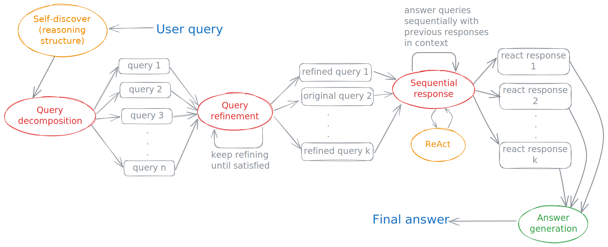

[](https://www.python.org/downloads/release/python-3120/)
[](#)
[](https://github.com/anirbanbasu/dqa/actions/workflows/python-linter-format-checker.yml)

# DQA: Difficult Questions Attempted

<p align="right">
  
</p>

The DQA aka _difficult questions attempted_ project aims to make large language models attempt difficult questions through an agent-based architecture. The project utilises agents and tools. This project is inspired by a tutorial [^1] from [Dean Sacoransky](https://www.linkedin.com/in/dean-sacoransky-6a671119a/). Unlike the tutorial's use of the [LangGraph framework from LangChain](https://langchain-ai.github.io/langgraph/) for building agents, this project makes use of [LlamaIndex Workflows](https://docs.llamaindex.ai/en/stable/module_guides/workflow/).

The tutorial uses the question _Which David Fincher film that stars Edward Norton does not star Brad Pitt?_ as a litmus test for assessing new AI systems. The answer is supposed to be _None_, but at the time of writing the tutorial (26 August 2024), the author states that ChatGPT's `gpt-4o` model generates the following response.
> The David Fincher film starring Edward Norton that does not star Brad Pitt is the "The Game" (1997). Edward Norton appears in an uncredited cameo role in this film.

The author further states that it is impossible "to answer this complex, multi-hop, logical question in one feed-forward pass of a neural network". At the end of the tutorial, the improved response to the question using agents that perform retrieval augmented generation (RAG) is seen to be the following.
> None, as there is only one mentioned David Fincher film starring Edward Norton, which is "Fight Club" and it stars Brad Pitt.

## Need for agents

This project implements an agent-based framework akin to the one mentioned in the tutorial [^1].

Let's focus on a slightly simpler test question that nonetheless baffles ChatGPT `gpt-4o`. Let's ask _Tell me the result of multiplying the number of 'r's in the word 'strawberry' with the sum of 3 and 4. Explain the process._ ChatGPT hopelessly responds to this with the following.
> Let's break down the problem step by step:
>
>Find the number of 'r's in the word "strawberry": The word "strawberry" contains 2 'r's.
>
> Find the sum of 3 and 4: $3+4=7$.
>
> Multiply the number of 'r's by the sum: $2 \times 7=14$.
>
> So, the result of multiplying the number of 'r's in "strawberry" by the sum of 3 and 4 is 14.

While ChatGPT did not make mistakes with the basic arithmetic operations, it counted the number of 'r's in the word 'strawberry' wrong. In contrast, the DQA workflow gets it right with the following answer, as of September 6, 2024, surprisingly using the `gpt-4o-mini` model.
>Final Answer: The result of multiplying the number of 'r's in the word 'strawberry' (which is 3) with the sum of 3 and 4 (which is 7) is 21.
>
> Detailed Explanation: To arrive at the final answer, we first determined the number of 'r's in the word 'strawberry'. The analysis revealed that there are 3 'r's in the word. Next, we calculated the sum of 3 and 4, which is 7. Finally, we multiplied these two results together: 3 (the number of 'r's) multiplied by 7 (the sum of 3 and 4) equals 21. Therefore, the final result is 21.

The reason the `gpt-4o-mini` model is able to count the number of 'r's correctly is because DQA lets it use a function to calculate the occurrences of a specific character or a sequence of characters in a string.

The approximate workflow for DQA can be summarised as follows.


This diagram shows that similar to the tutorial [^1], the DQA workflow performs query decomposition to ensure that complex queries are not sent to the LLM. The workflow further optimises the sub-questions (i.e., decompositions of the complex query) through a query refinement step, which loops if necessary.

Once the refined sub-questions are satisfactory, each such sub-question is sent to an instance of a [ReAct](https://arxiv.org/abs/2210.03629) "agent", also implemented as a workflow. Each ReAct workflow loops as necessary in order to answer the question given to it.

When all ReAct workflows have finished, the final step for answer generation collects the answers from the ReAct workflows and asks the LLM to generate a consolidated answer citing sources where relevant.

[^1]: Sacoransky, D., 2024. Build a RAG agent to answer complex questions. IBM Developer Tutorial. [URL](https://developer.ibm.com/tutorials/awb-build-rag-llm-agents/).

## Project status

| Date     |  Status   |  Notes   |
|----------|:-------------:|------|
| September 7, 2024 |  active |  Qdrant is not used. Cohere is flaky.  |
| August 31, 2024 |  active |  Using built-in ReAct agent.  |
| August 29, 2024 |  active |  Project started.  |


## Installation

Install and activate a Python virtual environment in the directory where you have cloned this repository. Let us refer to this directory as the _working directory_ or _WD_ (interchangeably) hereonafter. You could do that using [pyenv](https://github.com/pyenv/pyenv), for example. Make sure you use Python 3.12.0 or later. Inside the activated virtual environment, run the following.

```bash
python -m pip install -U pip
python -m pip install -U -r requirements.txt
```
If necessary, you can uninstall everything previously installed by `pip` (in the virtual environment) by running the following.

```bash
python -m pip freeze | cut -d "@" -f1 | xargs pip uninstall -y
```

In addition to Python dependencies, see the installation instructions of [Ollama](https://ollama.com/download) and that of [Qdrant](https://qdrant.tech/documentation/guides/installation/). You can install either of these on separate machines. Download the [tool calling model of Ollama](https://ollama.com/search?c=tools) that you want to use, e.g., `llama3.1` or `mistral-nemo`.

## Usage (local)

Make a copy of the file `.env.docker` in the _working directory_ as a `.env` file.

```bash
cp .env.docker .env
```

Change all occurrences of `host.docker.internal` to `localhost` or some other host or IP assuming that you have both Ollama and Qdrant available at ports 11434 and 6333, respectively, on your preferred host. Set the Ollama model to the tool calling model that you have downloaded on your Ollama installation. Set the value of the `LLM_PROVIDER` to the provider that you want to use. Supported names are `Anthropic`, `Cohere`, `Groq`, `Ollama` and `Open AI`.

You can use the environment variable `SUPPORTED_LLM_PROVIDERS` to further restrict the supported LLM providers to a subset of the aforementioned, such as, by setting the value to `Groq:Ollama` to allow only Groq and Ollama for some deployment of this app. Note that the only separating character between LLM provider names is a `:`. If you add a provider that is not in the aforementioned set, the app will throw an error and refuse to start.

Add the API keys for [Anthropic](https://console.anthropic.com/), [Cohere](https://dashboard.cohere.com/welcome/login), [Groq](https://console.groq.com/keys) or [Open AI](https://platform.openai.com/docs/overview) if you want to use any of these. In addition, add [an API key of Tavily](https://app.tavily.com/sign-in). Qdrant API key is not necessary if you are not using [Qdrant cloud](https://qdrant.tech/documentation/qdrant-cloud-api/).

With all these setup done, run the following to start the web server. The web server will serve a web user interface as well as a REST API. It is not configured to use HTTPS.

```bash
python src/webapp.py
```

The web UI will be available at [http://localhost:7860](http://localhost:7860).

## Usage (Docker)

In the `.env.docker`, both Ollama and Qdrant are expected to be available at ports 11434 and 6333, respectively, on your Docker host, i.e., `host.docker.internal`. Set them to some other host(s), if that is where your Ollama and Qdrant servers are available. Set the Ollama model to the tool calling model that you have downloaded on your Ollama installation.

Set the value of the `LLM_PROVIDER` to the provider that you want to use and add the API keys for Anthropic, Cohere, Groq and Open AI LLM providers as well as that of Tavily and optionally Qdrant as metioned above in the **Usage (local)** section.

With all these setup done, and assuming that you have Docker installed, you can build an image of the DQA app, create a container and start it as follows.

```bash
docker build -f local.dockerfile -t dqa .
docker create -p 7860:7860/tcp --name dqa-container dqa
docker container start dqa-container
```

You can replace the second line above to the following, in order to use a `.env` file on your Docker host that resides at the **absolute** path `PATH_TO_YOUR_.env_FILE`.

```bash
docker create -v /PATH_TO_YOUR_.env_FILE:/home/app_user/app/.env -p 7860:7860/tcp --name dqa-container dqa
```

The web server will serve a web user interface as well as a REST API at [http://localhost:7860](http://localhost:7860). It is not configured to use HTTPS.

## Contributing

Install [`pre-commit`](https://pre-commit.com/) for Git and [`ruff`](https://docs.astral.sh/ruff/installation/). Then enable `pre-commit` by running the following in the _WD_.

```bash
pre-commit install
```
Pull requests are welcome. For major changes, please open an issue first to discuss what you would like to change.

## License

[Apache License 2.0](https://choosealicense.com/licenses/apache-2.0/).
