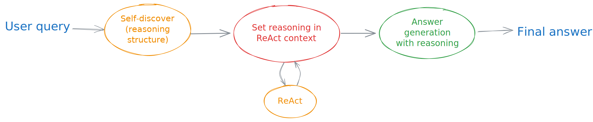

# Available workflows

This section details the workflows available to the DQA engine. These include only the combinations of such base workflows, such as ReAct.

## ReActSRC: ReAct with Structured Reasoning in Context

The _ReAct with Structured Reasoning in Context_ (ReActSRC) workflow can be approximately summarised as follows.

The workflow uses a [self-discover](https://arxiv.org/abs/2402.03620) "agent" to produce a reasoning structure but not answer the question. The workflow then calls one separate instance of a [ReAct](https://arxiv.org/abs/2210.03629) "agent", also implemented as a workflow. The ReAct workflows has as contextual information the previously generated reasoning structure.

When the ReAct workflow has finished, the final step takes the response from the ReAct workflow and asks the LLM to generate a consolidated answer citing sources where relevant, based on the initially generated reasoning structure.

## SSQReAct: Structured Sub-Question ReAct

The _Structured Sub-Question ReAct_ (SSQReAct) workflow can be approximately summarised as follows.

The workflow uses a [self-discover](https://arxiv.org/abs/2402.03620) "agent" to produce a reasoning structure but not answer the question. The workflow then performs query decomposition with respect to the reasoning structure to ensure that complex queries are not directly sent to the LLM. Instead, sub-questions (i.e., decompositions of the complex query) that help answer the complex query are sent. The workflow further optimises the sub-questions through a query refinement step, which loops if necessary, for a maximum number of allowed iterations.

Once the refined sub-questions are satisfactory, the sub-questions are answered sequentially by separate _sequential_ instances of a [ReAct](https://arxiv.org/abs/2210.03629) "agent", also implemented as a workflow. ReAct workflows have the responses from previous ReAct workflows as contextual information.

When all ReAct workflows have finished, the final step for answer generation collects the responses from the ReAct workflows and asks the LLM to generate a consolidated answer citing sources where relevant, in accordance with the initially generated reasoning structure.
